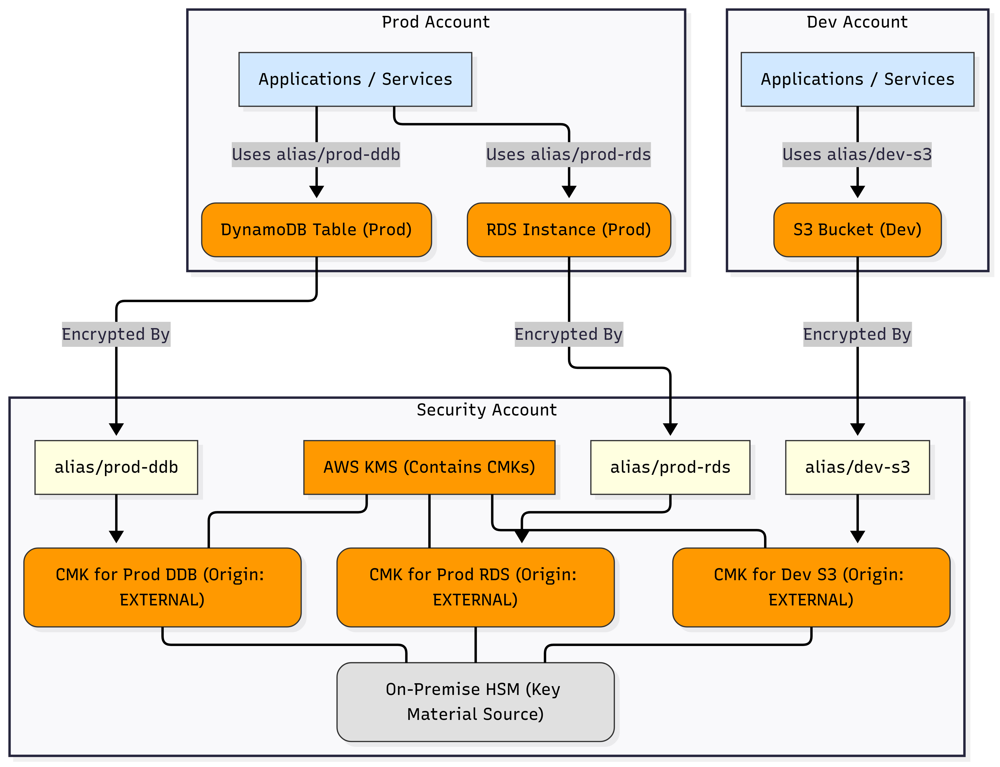
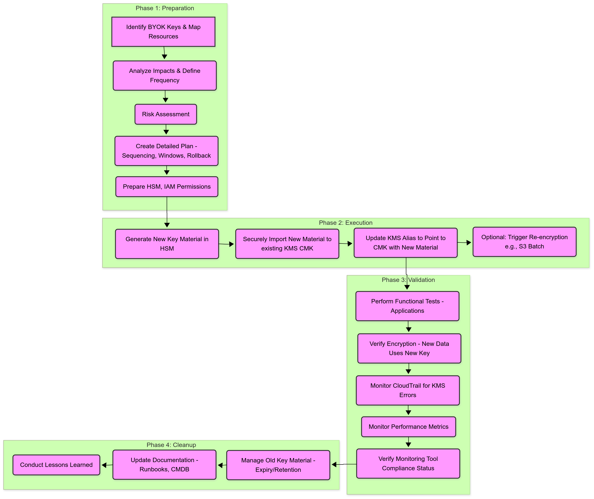

# Scenario 1: AWS KMS Key Rotation Strategy

## 1. Overview and Context

This scenario addresses a simulated regulatory requirement mandating periodic key rotation for all applicable AWS Key Management Service (KMS) Customer Master Keys (CMKs). The current environment utilizes a centralized KMS setup within a dedicated security account and employs the Bring Your Own Key (BYOK) model, importing key material generated from an on-premise Hardware Security Module (HSM).

The primary goal is to define and implement a robust, secure, and minimally disruptive key rotation strategy that complies with this new requirement across different environments and services.

## 2. Relevant Current Architecture

The existing encryption implementation, illustrated in the provided assessment details, relies on the following key components and principles:

*   **Centralized KMS:** Keys are managed in AWS KMS within a dedicated AWS security account, isolating key management operations.
*   **BYOK Model:** Key material is generated externally on an on-premise HSM and securely imported into AWS KMS. This implies `Origin: EXTERNAL` for the KMS keys.
*   **Segregation:** Encryption is segregated by environment (e.g., Dev, Prod) and by service. Unique keys (or key aliases pointing to potentially unique keys) are used per service (identified in diagrams: S3, RDS, DynamoDB) within each environment.
*   **Key Aliases:** KMS key aliases (e.g., `alias/service-environment`) are used to reference keys, abstracting applications from specific key IDs. This is crucial for simplifying rotation.
*   **Least Privilege:** Key policies are implemented following the principle of least privilege, granting only necessary permissions to users and services.



## 3. Question 1: Key Rotation Challenges and Impacts

Implementing mandatory rotation for existing BYOK KMS keys presents several challenges and potential impacts across technical, operational, and security dimensions:

### 3.1. Service-Specific Technical Challenges

AWS services interact with KMS keys differently, leading to varied rotation impacts:

*   **Amazon S3:**
    *   **Challenge:** Automatic KMS key rotation (via AWS) *does not* apply to existing S3 objects. When a key is rotated (new key material imported or alias updated), only *new* objects written to the bucket will be encrypted with the new key version. Existing objects remain encrypted with the previous key version.
    *   **Impact:** To achieve full compliance for data-at-rest over time, existing objects may require manual re-encryption (e.g., using S3 Batch Operations with a Lambda function or a COPY operation in place). This can be time-consuming and potentially costly for large buckets.
*   **Amazon RDS:**
    *   **Challenge:** Changing the KMS key associated with an encrypted RDS instance typically involves creating a new snapshot, copying the snapshot while specifying the *new* KMS key, and then restoring the instance from the encrypted copy or modifying the instance directly (depending on DB engine and specifics).
    *   **Impact:** This process often requires downtime for the database instance during the snapshot copy and restore/modification phase. The duration depends on database size and underlying operations. Careful planning and execution within maintenance windows are critical. Existing automated snapshots will also use the key version active at the time of their creation.
*   **Amazon DynamoDB:**
    *   **Challenge:** Tables encrypted with KMS (SSE-KMS) using a Customer Managed Key (CMK) handle key reference typically via alias. When the alias points to a new key/version, *newly written data* will use that new key. AWS manages the background encryption process. Similar to S3, DynamoDB *does not automatically re-encrypt all existing data* immediately upon alias change or key material rotation. Re-encryption happens over time as data is naturally rewritten or potentially through a full table export/import or backup/restore cycle if immediate compliance is mandated for all data.
    *   **Impact:** Potential performance implications during periods of heavy writes or explicit re-encryption activities. The primary impact is ensuring compliance timelines align with how DynamoDB handles key changes for existing data.


### 3.2. Operational Challenges

*   **Coordination:** Managing rotation across multiple environments (Dev, Int, Prod) and various service teams requires significant coordination and planning.
*   **Alias Management:** Strict discipline is needed to ensure applications *consistently* use key aliases instead of hardcoded Key IDs. Any direct Key ID usage will break upon rotation.
*   **BYOK Process Complexity:** The process of generating, securely transporting, and importing new key material from the on-premise HSM adds operational overhead compared to AWS-generated keys with automatic rotation.
*   **Testing and Validation:** Thorough testing is required in lower environments before applying changes in production to ensure applications function correctly with the rotated keys.
*   **Rollback Complexity:** Rolling back a key rotation, especially after new data has been written with the new key, can be complex and may require restoring from backups.

### 3.3. Application and Security Impacts

*   **Potential Downtime:** As noted for RDS, downtime might be required, impacting application availability.
*   **Transitional Risk:** During the rotation window (importing new key, updating alias, validating), there's a brief period where operational errors could potentially impact encryption availability or correctness if not handled carefully.
*   **Auditing and Compliance:** Ensuring the entire process is auditable and provides clear evidence of compliance (which key was active when, verification of rotation) is crucial. Key creation/import timestamps in CloudTrail are vital.
*   **Policy Updates:** Key policies might need review or updates if rotation affects how keys are administered or used.

### 3.4. Cost Implications

*   **API Costs:** KMS API calls (encryption, decryption, import) might increase, especially if manual re-encryption activities (like S3 Batch) are performed at scale.
*   **Operational Effort:** The human effort involved in planning, executing, and validating the rotation represents a cost.
*   **Compute/Storage Costs:** Re-encryption tasks (S3 Batch, RDS snapshot copy/restore) can incur temporary compute and storage costs.

## 4. Question 2: Key Rotation Process (High-Level)

The key rotation process for BYOK keys requires careful planning and execution. It can be broken down into the following high-level phases:

### 4.1. Phase 1: Preparation and Planning

*   **Inventory and Analysis:**
    *   Identify all KMS keys currently in use (`Origin: EXTERNAL`) across all environments and services.
    *   Map each key alias to the specific resources it encrypts (S3 buckets, RDS instances, DynamoDB tables, etc.). Automated scripting (e.g., using AWS SDK/CLI) is highly recommended for accuracy at scale.
    *   Analyze potential impacts based on service type (as detailed in Section 3).
    *   Define the target rotation frequency based on regulatory requirements and internal security policies.
*   **Risk Assessment:** Evaluate risks associated with the rotation process for critical applications and data.
*   **Detailed Plan:** Create a detailed execution plan, including:
    *   Sequencing (e.g., which environments/services rotate first - typically non-production first).
    *   Maintenance windows for services requiring downtime (like RDS).
    *   Communication plan for stakeholders and application teams.
    *   Rollback procedures in case of critical failure.
*   **Pre-computation/Checks:** Ensure the on-premise HSM is ready, personnel are trained, and necessary IAM permissions for import are in place.

### 4.2. Phase 2: Execution

*   **Generate New Key Material:** Create new cryptographic key material on the designated on-premise HSM according to its procedures.
*   **Secure Import:** Securely import the new key material into the *existing* target KMS CMK in the security account. (Refer to Section 6 for details on securing this transport).
    *   **Important:** We are *rotating the material* of an existing CMK, not creating a brand new CMK for each rotation, unless policy dictates otherwise (which adds complexity). Importing new material automatically creates a new *backing key version* within the same CMK ARN/ID.
*   **Update Key Alias:** **Crucially**, update the relevant KMS key alias (e.g., `alias/service-environment`) to point to the CMK *after* the new key material has been successfully imported. This redirects all *new* encryption/decryption operations using that alias to utilize the newly imported key material. The AWS CLI `update-alias` or SDK equivalent is used here.
*   **Trigger Re-encryption (If Necessary):** For services like S3 where existing data isn't automatically re-encrypted, initiate planned re-encryption processes (e.g., S3 Batch Operations) if required by compliance timelines.

### 4.3. Phase 3: Validation and Monitoring

*   **Functional Testing:** Application teams perform functional tests to verify applications relying on the rotated keys operate correctly.
*   **Encryption Verification:**
    *   Check new objects/data created in S3, RDS, DynamoDB are using the new key version (can be verified via API calls like `HeadObject` in S3, checking KMS Key ID references, or through CloudTrail event analysis).
    *   Monitor CloudTrail logs for any KMS encryption/decryption errors related to the rotated keys or aliases.
*   **Performance Monitoring:** Monitor application and database performance metrics for any unexpected degradation.
*   **Compliance Monitoring:** Verify that the monitoring setup (detailed in Section 5) correctly reflects the new key status and rotation timestamp.

### 4.4. Phase 4: Post-Rotation Cleanup

*   **Old Key Material:** The previous key material imported into KMS remains available for decrypting older data until it expires (if an expiration date was set during import) or is manually deleted according to retention policies. *Note: Deleting key material makes data encrypted solely with it unrecoverable.* A safer approach is often to let unused imported material expire naturally or remain indefinitely if storage permits and regulations allow, relying on the CMK *state* (e.g., `Disabled`, `PendingDeletion`) for control if needed.
*   **Documentation:** Update operational runbooks, CMDBs, or documentation to reflect the completed rotation cycle and the timestamp.
*   **Lessons Learned:** Conduct a brief retrospective to identify improvements for the next rotation cycle.



### 4.5. Automation and DevSecOps Considerations

*   **Automate Where Possible:** Script inventory checks, alias updates, and validation steps to reduce manual effort and errors.
*   **Security Checkpoints:** Integrate security validation steps (e.g., checking key policy correctness post-rotation) into the process.
*   **Infrastructure as Code (IaC):** While the key material import itself is a manual/scripted operation, surrounding infrastructure (like monitoring rules detailed later) should be managed via IaC (Terraform/CloudFormation).

## 5. Question 3: Monitoring Non-Compliant Resources (AWS Managed Services)

To continuously monitor resources encrypted with BYOK keys and ensure their key material is rotated according to the defined policy (e.g., annually), we can leverage several integrated AWS managed services. The core challenge lies in tracking the age of the *imported key material* for keys with `Origin: EXTERNAL`, as standard AWS Config rules primarily check if automatic rotation is enabled (not applicable here).

### 5.1. Proposed Monitoring Architecture

The recommended approach involves using **AWS Config** with a **custom rule** backed by an **AWS Lambda function**. This setup allows for tailored compliance checks specific to the BYOK key rotation requirement.

**Key Services Involved:**

1.  **AWS Config:**
    *   **Purpose:** Resource inventory, configuration history, and compliance checking framework.
    *   **Role:** Deploys a *custom rule* that periodically evaluates the compliance status of BYOK KMS keys.
2.  **AWS Lambda:**
    *   **Purpose:** Provides the custom evaluation logic for the AWS Config rule.
    *   **Role:** The Lambda function code will:
        *   Receive the KMS key ARN (or identifier) as input from AWS Config.
        *   Verify the key `Origin` is `EXTERNAL`.
        *   Query **AWS CloudTrail** logs (using API calls like `lookup_events`) to find the timestamp of the *most recent successful* `ImportKeyMaterial` event for that specific key ARN.
        *   Calculate the age of the imported key material based on the current date and the event timestamp.
        *   Compare this age against the mandated rotation period (e.g., 365 days, configurable via Lambda environment variables or rule parameters).
        *   Return the compliance status (`COMPLIANT` or `NON_COMPLIANT`) and annotation back to AWS Config.
3.  **AWS CloudTrail:**
    *   **Purpose:** Logs API activity within the AWS account.
    *   **Role:** Provides the essential audit trail containing the `ImportKeyMaterial` events and their timestamps, which the Lambda function queries to determine the last rotation date. CloudTrail must be enabled and configured to log KMS events.
4.  **Amazon EventBridge:**
    *   **Purpose:** Central event bus service.
    *   **Role:** Captures compliance change events published by AWS Config (e.g., when a key transitions to `NON_COMPLIANT`). These events can trigger downstream actions like:
        *   Sending notifications via **Amazon SNS** (Simple Notification Service) to security/ops teams.
        *   Triggering automated remediation workflows (if applicable and safe).
5.  **AWS Security Hub:**
    *   **Purpose:** Centralized view of security and compliance findings.
    *   **Role:** Integrates with AWS Config to ingest compliance findings. This provides a unified dashboard to view non-compliant keys alongside other security alerts across the AWS environment.
6.  **Amazon CloudWatch:**
    *   **Purpose:** Monitoring and observability service.
    *   **Role:**
        *   Collects logs from the Lambda function for debugging and monitoring its execution.
        *   Can be used to create dashboards visualizing the overall compliance status (e.g., number of compliant vs. non-compliant keys over time) based on metrics derived from Config/EventBridge events.
        *   Can trigger CloudWatch Alarms based on non-compliance events or Lambda errors.


### 5.2. Implementation Considerations

*   **Config Rule Trigger:** The custom AWS Config rule can be triggered periodically (e.g., daily) to evaluate all KMS keys or change-triggered based on configuration changes to `AWS::KMS::Key` resources. A periodic trigger is generally more suitable for time-based compliance like key material age.
*   **Lambda Permissions:** The Lambda function's execution role needs permissions to:
    *   `kms:DescribeKey` (to get key details like Origin).
    *   `cloudtrail:LookupEvents` (to query import history).
    *   `config:PutEvaluations` (to send results back to AWS Config).
    *   Logging permissions (`logs:CreateLogGroup`, `logs:CreateLogStream`, `logs:PutLogEvents`).
*   **CloudTrail Scope:** Ensure the CloudTrail trail used for querying covers the region(s) where the KMS keys reside and includes KMS management events. If keys are multi-Region replicas, the logic might need adjustments.
*   **Scalability and Cost:** Consider the number of keys to monitor. AWS Config rule evaluations and Lambda invocations incur costs. Ensure CloudTrail query efficiency in the Lambda function.
*   **Bootstrapping:** When initially deploying the rule, all keys might be evaluated. There needs to be a defined process or initial grace period for keys newly created or recently rotated just before the rule deployment.

#### IaC Example: Terraform Snippet for Custom Rule

Managing the monitoring components via Infrastructure as Code (IaC) like Terraform is highly recommended. Below is an illustrative snippet showing how the AWS Config custom rule and its link to the evaluation Lambda function could be defined:

```terraform
# --- Example Terraform Snippet for AWS Config Custom Rule (Illustrative) ---

variable "key_rotation_policy_days" {
  description = "Maximum allowed age (in days) for imported key material."
  type        = number
  default     = 365
}

resource "aws_lambda_function" "kms_byok_rotation_check_lambda" {
  # Assume Lambda function for checking key material age is defined elsewhere
  # ... (configuration for the lambda function)
  function_name = "kms-byok-rotation-check"
  # ... (role, handler, runtime, etc.)

  environment {
    variables = {
      ROTATION_PERIOD_DAYS = var.key_rotation_policy_days
    }
  }
}

resource "aws_config_config_rule" "byok_key_material_age" {
  name = "byok-key-material-age-check"

  source {
    owner             = "CUSTOM_LAMBDA"
    source_identifier = aws_lambda_function.kms_byok_rotation_check_lambda.arn # Link to the Lambda function ARN

    # Can add source_detail for message types if needed (ConfigurationItemChangeNotification | OversizedConfigurationItemChangeNotification | ScheduledNotification)
  }

  # Scope to only check AWS KMS Keys
  scope {
    compliance_resource_types = ["AWS::KMS::Key"]
  }

  # Optional: Input parameters to pass to Lambda (e.g., rotation period)
  # Alternatively, use Lambda environment variables as shown above.
  # input_parameters = jsonencode({
  #   maxKeyMaterialAgeDays = var.key_rotation_policy_days
  # })

  # Trigger type (e.g., run rule periodically)
  maximum_execution_frequency = "TwentyFour_Hours" # Or Six_Hours, Twelve_Hours etc.
}

resource "aws_lambda_permission" "allow_config_to_call_lambda" {
  statement_id  = "AllowConfigToInvokeKMSCheckLambda"
  action        = "lambda:InvokeFunction"
  function_name = aws_lambda_function.kms_byok_rotation_check_lambda.function_name
  principal     = "config.amazonaws.com"
  source_arn    = aws_config_config_rule.byok_key_material_age.arn
}

# Note: Ensure CloudTrail is properly configured and the Lambda execution role
# has necessary permissions (kms:DescribeKey, cloudtrail:LookupEvents, config:PutEvaluations).
```

### 5.3. Identifying Non-Compliant *Resources*

While the Config rule primarily targets the *KMS key's* compliance status, identifying the specific *resources* (RDS, S3, DynamoDB) using a non-compliant key requires an additional step:

1.  **From Config/Security Hub:** When a key is marked `NON_COMPLIANT`, obtain its ARN.
2.  **Resource Mapping:** Use AWS SDK/CLI scripts or AWS Config advanced queries to find resources that are configured to use the specific alias associated with the non-compliant KMS key ARN. This leverages the inventory capabilities of AWS Config or direct API calls (`describe-db-instances`, `get-bucket-encryption`, `describe-table`).
    *   *Note:* This mapping assumes consistent use of aliases. If resources reference keys by ARN directly, that simplifies lookup but complicates rotation itself.

This two-step approach (identify non-compliant key -> map key alias to resources) effectively addresses the requirement to identify non-compliant resources using AWS managed services as the foundation.

## 6. Question 4: Securing Key Material Transportation (HSM to KMS)

Securing the transport of cryptographic key material from the on-premise HSM to AWS KMS is paramount to maintain the integrity and confidentiality of the keys throughout the BYOK process. The "best way" involves a defense-in-depth approach, layering multiple security controls:

### 6.1. Pre-computation: Generating Wrapping Key and Import Token

Before exporting material from the HSM, initiate the import process from the AWS side:

1.  **Specify Target CMK:** Identify the existing KMS Customer Managed Key (CMK) with `Origin: EXTERNAL` for which you want to import new key material.
2.  **Get Parameters for Import:** Use the AWS Management Console, CLI (`aws kms get-parameters-for-import`), or SDK to retrieve:
    *   **Public Key:** An RSA public key provided by AWS KMS, specific to this import operation.
    *   **Import Token:** A unique token associated with the public key, valid for 24 hours.
3.  **Secure Download:** Securely download and store this public key and import token. Access should be restricted to authorized personnel involved in the key ceremony.

### 6.2. Key Material Encryption at Source (Envelope Encryption Principle)

The core security relies on encrypting the key material *before* it leaves the secure boundary of the on-premise HSM environment:

1.  **Generate Key Material:** Generate the actual symmetric key material (e.g., 256-bit AES key) within the HSM according to established procedures.
2.  **Wrap/Encrypt the Material:** Use the RSA **public key** obtained from AWS KMS (Step 6.1) to encrypt the symmetric key material.
    *   **Algorithm:** This encryption *must* use the `RSAES_OAEP_SHA-1` or `RSAES_OAEP_SHA-256` padding scheme, as specified by AWS KMS when you requested the parameters. This effectively performs envelope encryption: the AWS public key wraps the actual key material.
    *   **HSM Capability:** The on-premise HSM environment must support exporting key material encrypted with an external RSA public key using the required OAEP padding scheme.

### 6.3. Secure Transmission Channel

Even though the key material itself is encrypted, the channel used for transport must also be secured:

1.  **TLS Encryption:** All AWS API endpoints, including the KMS endpoint used for `ImportKeyMaterial`, require **HTTPS (TLS)**. This encrypts the entire communication channel, protecting the encrypted key material and the import token from eavesdropping or tampering *in transit*. Ensure clients use up-to-date TLS versions (e.g., TLS 1.2 or higher).
2.  **Network Path:**
    *   **Recommended:** Transmit the import request over a private, dedicated network connection like **AWS Direct Connect** or a secure **VPN Site-to-Site** connection between the on-premise network and the AWS VPC. This avoids traversing the public internet.
    *   **Alternative (Less Secure):** If using the public internet, rely solely on TLS, ensuring strict endpoint validation on the client-side.

### 6.4. Authenticated and Authorized Import Operation

The actual API call to import the material must be secured:

1.  **IAM Credentials:** Use AWS IAM credentials (e.g., an IAM user with access keys or temporary credentials from an IAM role) that have the *minimum necessary permissions*.
2.  **Least Privilege:** The required permission is `kms:ImportKeyMaterial` *only* on the specific target CMK ARN. Avoid granting broader `kms:*` permissions. Consider using temporary credentials specifically generated for the key import ceremony.
3.  **Import API Call:** Use the AWS CLI (`aws kms import-key-material`) or SDK to make the call, providing:
    *   The target CMK ID/ARN.
    *   The downloaded **Import Token**.
    *   The **Encrypted Key Material** (as generated in Step 6.2).
    *   The **Expiration Model** (e.g., `KEY_MATERIAL_EXPIRES`) and optionally a `ValidTo` timestamp, dictating when the imported material automatically expires within KMS.

### 6.5. Post-Import Verification and Auditing

1.  **API Response:** Check for a successful response from the `ImportKeyMaterial` API call.
2.  **Key State:** Verify the target CMK state in KMS remains `Enabled` and confirm the key material has been imported (details might be visible via `DescribeKey`, though not the material itself).
3.  **CloudTrail Logging:** Ensure AWS CloudTrail is enabled and configured to capture the `ImportKeyMaterial` event. This log entry serves as a crucial audit record, timestamping the operation and identifying the principal who performed it. Regularly audit these logs.


By layering these controls—encrypting the key material at the source using AWS-provided public keys, transmitting over secure channels (TLS, private network), and using tightly scoped IAM permissions for the import API call—the transportation process achieves a high degree of security required for sensitive cryptographic material.

#### SDK Example: Conceptual Python Snippet for Import

The following conceptual Python snippet using the Boto3 SDK illustrates the key API interactions involved in the BYOK import process described above. Note that error handling and the specific interaction with the on-premise HSM (`on_prem_hsm_encrypt_function`) would need to be implemented based on the actual environment.

```python
# --- Conceptual Python Snippet using Boto3 for Key Import ---

import boto3
import base64 # For handling binary data

# Assume kms_client is initialized: kms_client = boto3.client('kms')
# Assume target_key_id is the ARN/ID of the KMS key with Origin=EXTERNAL
# Assume on_prem_hsm_encrypt_function(plain_key_material, rsa_public_key) is a function
# that interacts with the HSM to wrap the plain material using the provided public key
# and returns the base64-encoded ciphertext.

def secure_import_key_material(kms_client, target_key_id, plain_key_material_bytes):
    """Conceptual function for BYOK import process."""

    try:
        # 1. Get parameters for import from AWS KMS
        print("Requesting import parameters from AWS KMS...")
        response_params = kms_client.get_parameters_for_import(
            KeyId=target_key_id,
            WrappingAlgorithm='RSAES_OAEP_SHA_256', # Or RSAES_OAEP_SHA_1
            WrappingKeySpec='RSA_2048' # Or RSA_3072, RSA_4096 matching the CMK spec
        )

        import_token = response_params['ImportToken']
        public_key_bytes = response_params['PublicKey'] # This is the RSA public key from AWS

        print("Successfully retrieved import token and public key.")

        # 2. Wrap the key material using the on-prem HSM
        # This part interacts with the HSM environment.
        # The HSM uses the 'public_key_bytes' to encrypt 'plain_key_material_bytes'.
        print("Wrapping key material using on-prem HSM...")
        encrypted_key_material_b64 = on_prem_hsm_encrypt_function(
            plain_key_material_bytes,
            public_key_bytes
        )
        # Decode from base64 provided by the HSM function if necessary for Boto3
        encrypted_key_material_bytes = base64.b64decode(encrypted_key_material_b64)
        print("Key material wrapped.")

        # 3. Import the encrypted key material into AWS KMS
        print("Importing encrypted key material into KMS...")
        response_import = kms_client.import_key_material(
            KeyId=target_key_id,
            ImportToken=import_token,
            EncryptedKeyMaterial=encrypted_key_material_bytes,
            ExpirationModel='KEY_MATERIAL_EXPIRES', # Or KEY_MATERIAL_DOES_NOT_EXPIRE
            ValidTo=None # Optional: specify an expiration datetime object
        )

        print(f"Import API call successful: {response_import}")
        print("Key material imported successfully!")
        return True

    except kms_client.exceptions.ExpiredImportTokenException:
        print("Error: The import token has expired. Please retrieve new parameters.")
        return False
    except Exception as e:
        print(f"An error occurred during key import: {e}")
        return False

# --- Example Usage (Conceptual) ---
# kms = boto3.client('kms', region_name='us-east-1')
# key_id = 'arn:aws:kms:us-east-1:111122223333:key/your-key-id'
# # Assume 'new_aes_key_bytes' holds your raw 32-byte AES key from the HSM
# # success = secure_import_key_material(kms, key_id, new_aes_key_bytes)

# --- End of Snippet ---
```

## 7. Additional Considerations and Next Steps

Beyond directly answering the questions, several strategic and operational considerations enhance the proposed key rotation strategy:

### 7.1. DevSecOps Integration

*   **Security as Code:** Manage the AWS Config custom rule, Lambda function, associated IAM roles, and EventBridge rules using Infrastructure as Code (IaC - Terraform or CloudFormation) for repeatable, auditable, and version-controlled deployment.
*   **Automated Testing:** Incorporate automated tests for the Lambda function's logic and potentially simulate KMS/CloudTrail interactions in a test environment.
*   **CI/CD for Monitoring:** Deploy updates to the monitoring solution (Config rule, Lambda) through a CI/CD pipeline that includes security scans and policy checks.
*   **Feedback Loop:** Ensure notifications from EventBridge/SNS are routed effectively into incident management or ticketing systems used by Ops/Security teams for timely response.

### 7.2. Pragmatic Implementation

*   **Phased Rollout:** Implement the key rotation process (Phase 2 execution) in waves, starting with non-critical, lower environments (Dev, Test). Gather lessons learned before proceeding to production.
*   **Clear Rollback Plans:** Define specific, actionable rollback procedures for each phase, especially for critical failures during key import or alias update. Know how to revert an alias change quickly and what the implications are for data encrypted during the failed attempt.
*   **Communication and Training:** Over-communicate with application teams about rotation schedules, potential impacts, and the importance of using key aliases. Ensure operations teams are trained on the BYOK import procedures and monitoring alerts.
*   **Grace Periods:** For the monitoring solution (Section 5), implement a reasonable grace period for newly created keys or after a rotation, preventing false positive non-compliance alerts immediately after setup or rotation.

### 7.3. Potential Future Enhancements / Alternatives

*   **Granularity of Rotation:** Evaluate if a single rotation schedule fits all data types and regulatory needs, or if more frequent rotation is required for certain sensitive data (potentially using different keys/aliases).
*   **AWS CloudHSM:** For organizations seeking FIPS 140-2 Level 3 validation *within* AWS, migrating from on-premise HSMs to AWS CloudHSM could be considered. This simplifies the BYOK import process (as CloudHSM integrates more directly with KMS) but involves migrating the HSM dependency to the cloud.
*   **Automated Re-encryption:** Explore further automation for S3 re-encryption using Step Functions orchestration for S3 Batch Operations triggered after successful alias updates.
*   **Key Policy Management:** Use IaC or policy management tools (like OPA Gatekeeper, if applicable in a Kubernetes context accessing KMS) to manage and audit KMS key policies consistently.

Completing these steps provides a comprehensive approach to implementing and managing KMS key rotation for BYOK keys, addressing both the immediate requirements and long-term operational sustainability.

## 8. References

*   **AWS Key Management Service (KMS) - Key Rotation:**
    *   [Rotating keys](https://docs.aws.amazon.com/kms/latest/developerguide/rotate-keys.html)
    *   [Importing key material in AWS KMS keys](https://docs.aws.amazon.com/kms/latest/developerguide/importing-keys.html)
    *   [GetParametersForImport API](https://docs.aws.amazon.com/kms/latest/APIReference/API_GetParametersForImport.html)
    *   [ImportKeyMaterial API](https://docs.aws.amazon.com/kms/latest/APIReference/API_ImportKeyMaterial.html)
    *   [AWS KMS concepts](https://docs.aws.amazon.com/kms/latest/developerguide/concepts.html) (Origin, Aliases, CMKs)
*   **AWS Config:**
    *   [AWS Config Developer Guide](https://docs.aws.amazon.com/config/latest/developerguide/WhatIsConfig.html)
    *   [Custom Rules for AWS Config](https://docs.aws.amazon.com/config/latest/developerguide/evaluate-config_develop-rules.html)
    *   [Lambda Function Handler for Custom Config Rules (Python Example)](https://docs.aws.amazon.com/config/latest/developerguide/evaluate-config_develop-rules_python-sample.html)
*   **AWS CloudTrail:**
    *   [Logging AWS KMS API calls with AWS CloudTrail](https://docs.aws.amazon.com/kms/latest/developerguide/logging-using-cloudtrail.html)
    *   [LookupEvents API](https://docs.aws.amazon.com/awscloudtrail/latest/APIReference/API_LookupEvents.html)
*   **AWS Lambda:**
    *   [AWS Lambda Developer Guide](https://docs.aws.amazon.com/lambda/latest/dg/welcome.html)
*   **Amazon EventBridge:**
    *   [Amazon EventBridge User Guide](https://docs.aws.amazon.com/eventbridge/latest/userguide/eb-what-is.html)
    *   [Tutorial: Log AWS Config compliance changes using EventBridge](https://docs.aws.amazon.com/config/latest/developerguide/logging-using-eventbridge.html)
*   **AWS Security Hub:**
    *   [AWS Security Hub User Guide](https://docs.aws.amazon.com/securityhub/latest/userguide/what-is-securityhub.html)
*   **Service-Specific Encryption:**
    *   [Protecting data using server-side encryption with KMS keys stored in AWS KMS (SSE-KMS) - S3](https://docs.aws.amazon.com/AmazonS3/latest/userguide/UsingKMSEncryption.html)
    *   [Using server-side encryption for data at rest in DynamoDB](https://docs.aws.amazon.com/amazondynamodb/latest/developerguide/EncryptionAtRest.html)
    *   [Encrypting Amazon RDS resources](https://docs.aws.amazon.com/AmazonRDS/latest/UserGuide/Overview.Encryption.html)