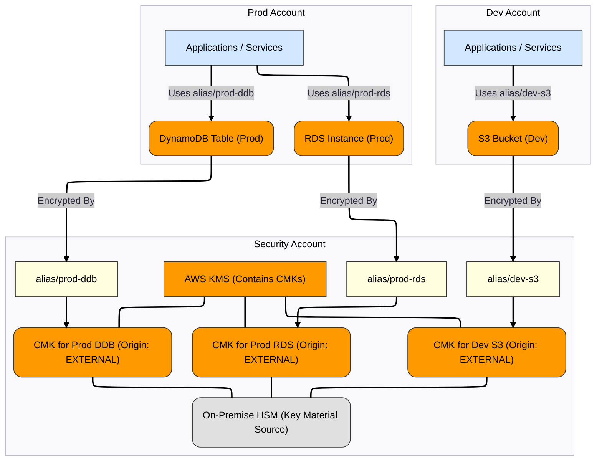

```mermaid
---
config:
  layout: elk
  theme: redux
---
flowchart TD
 subgraph subGraph0["Security Account"]
        KMS["AWS KMS (Contains CMKs)"]
        Key_DevS3("CMK for Dev S3 (Origin: EXTERNAL)")
        Alias_DevS3["alias/dev-s3"]
        Key_ProdRDS("CMK for Prod RDS (Origin: EXTERNAL)")
        Alias_ProdRDS["alias/prod-rds"]
        Key_ProdDDB("CMK for Prod DDB (Origin: EXTERNAL)")
        Alias_ProdDDB["alias/prod-ddb"]
        HSM("On-Premise HSM (Key Material Source)")
  end
 subgraph subGraph1["Dev Account"]
        S3Dev("S3 Bucket (Dev)")
        AppDev["Applications / Services"]
  end
 subgraph subGraph2["Prod Account"]
        RDSPRod("RDS Instance (Prod)")
        AppProd["Applications / Services"]
        DDBProd("DynamoDB Table (Prod)")
  end
    Alias_DevS3 --> Key_DevS3
    Alias_ProdRDS --> Key_ProdRDS
    Alias_ProdDDB --> Key_ProdDDB
    KMS --- Key_DevS3 & Key_ProdRDS & Key_ProdDDB
    Key_DevS3 --- HSM
    Key_ProdRDS --- HSM
    Key_ProdDDB --- HSM
    AppDev -- "Uses alias/dev-s3" --> S3Dev
    S3Dev -- Encrypted By ---> Alias_DevS3
    AppProd -- "Uses alias/prod-rds" --> RDSPRod
    AppProd -- "Uses alias/prod-ddb" --> DDBProd
    RDSPRod -- Encrypted By ---> Alias_ProdRDS
    DDBProd -- Encrypted By ---> Alias_ProdDDB
     KMS:::aws
     Key_DevS3:::aws
     Alias_DevS3:::alias
     Key_ProdRDS:::aws
     Alias_ProdRDS:::alias
     Key_ProdDDB:::aws
     Alias_ProdDDB:::alias
     HSM:::onprem
     S3Dev:::aws
     AppDev:::account
     RDSPRod:::aws
     AppProd:::account
     DDBProd:::aws
    classDef aws fill:#FF9900,stroke:#333,stroke-width:1px,color:#000
    classDef account fill:#D1E8FF,stroke:#333,stroke-width:1px,color:#000
    classDef onprem fill:#E0E0E0,stroke:#333,stroke-width:1px,color:#000
    classDef alias fill:#FFFFE0,stroke:#333,stroke-width:1px,color:#000
```