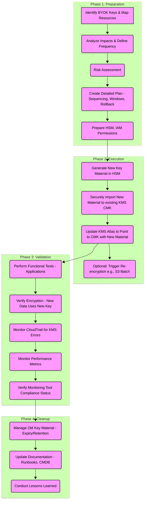

```mermaid
---
config:
  layout: fixed
  theme: forest
  look: neo
---
flowchart TD
 subgraph subGraph0["Phase 1: Preparation"]
        A2("Analyze Impacts & Define Frequency")
        A1["Identify BYOK Keys & Map Resources"]
        A3("Risk Assessment")
        A4("Create Detailed Plan - Sequencing, Windows, Rollback")
        A5("Prepare HSM, IAM Permissions")
  end
 subgraph subGraph1["Phase 2: Execution"]
        B2("Securely Import New Material to existing KMS CMK")
        B1("Generate New Key Material in HSM")
        B3("Update KMS Alias to Point to CMK with New Material")
        B4("Optional: Trigger Re-encryption e.g., S3 Batch")
  end
 subgraph subGraph2["Phase 3: Validation"]
        C2("Verify Encryption - New Data Uses New Key")
        C1("Perform Functional Tests - Applications")
        C3("Monitor CloudTrail for KMS Errors")
        C4("Monitor Performance Metrics")
        C5("Verify Monitoring Tool Compliance Status")
  end
 subgraph subGraph3["Phase 4: Cleanup"]
        D2("Update Documentation - Runbooks, CMDB")
        D1("Manage Old Key Material - Expiry/Retention")
        D3("Conduct Lessons Learned")
  end
    A1 --> A2
    A2 --> A3
    A3 --> A4
    A4 --> A5
    B1 --> B2
    B2 --> B3
    B3 --> B4 & C1
    C1 --> C2
    C2 --> C3
    C3 --> C4
    C4 --> C5
    D1 --> D2
    D2 --> D3
    A5 --> B1
    C5 --> D1
     A2:::phase
     A1:::phase
     A3:::phase
     A4:::phase
     A5:::phase
     B2:::phase
     B1:::phase
     B3:::phase
     B4:::phase
     C2:::phase
     C1:::phase
     C3:::phase
     C4:::phase
     C5:::phase
     D2:::phase
     D1:::phase
     D3:::phase
    classDef phase fill:#f9f,stroke:#333,stroke-width:2px
    style subGraph0 stroke:#FFE0B2
```