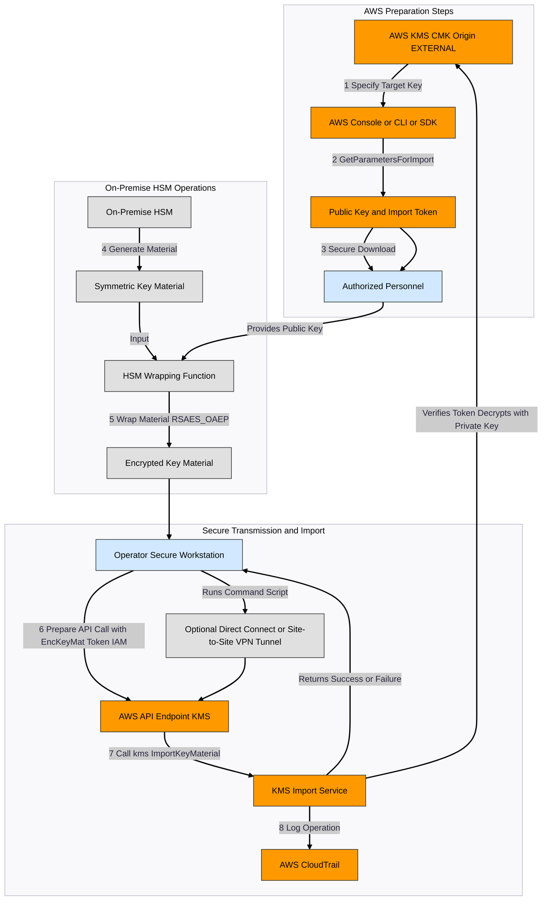

```mermaid
---
config:
  theme: redux
---
flowchart TB
subgraph aws_prep ["AWS Preparation Steps"]
  direction LR
  AWS_KMS["AWS KMS CMK Origin EXTERNAL"]
  AWS_KMS -->|1 Specify Target Key| AWS_Console["AWS Console or CLI or SDK"]
  AWS_Console -->|2 GetParametersForImport| AWS_Params["Public Key and Import Token"]
  AWS_Params -->|3 Secure Download| User["Authorized Personnel"]
end
subgraph on_prem_hsm ["On-Premise HSM Operations"]
  direction TB
  HSM["On-Premise HSM"]
  HSM -->|4 Generate Material| KeyMat["Symmetric Key Material"]
  KeyMat -->|Input| HSM_Wrap["HSM Wrapping Function"]
  HSM_Wrap -->|5 Wrap Material RSAES_OAEP| EncKeyMat["Encrypted Key Material"]
end
subgraph secure_import ["Secure Transmission and Import"]
  direction LR
  User_Laptop["Operator Secure Workstation"]
  API_GW["AWS API Endpoint KMS"]
  VPN_DC["Optional Direct Connect or Site-to-Site VPN Tunnel"]
  User_Laptop -->|6 Prepare API Call with EncKeyMat Token IAM| API_GW
  VPN_DC --> API_GW
  API_GW -->|7 Call kms ImportKeyMaterial| KMS_Import["KMS Import Service"]
  KMS_Import -->|Verifies Token Decrypts with Private Key| AWS_KMS
  KMS_Import -->|Returns Success or Failure| User_Laptop
  KMS_Import -->|8 Log Operation| CloudTrail["AWS CloudTrail"]
end
User -->|Provides Public Key| HSM_Wrap
AWS_Params --> User
EncKeyMat --> User_Laptop
User_Laptop -->|Runs Command Script| VPN_DC
classDef aws fill:#FF9900,stroke:#333,stroke-width:1px,color:#000
classDef onprem fill:#E0E0E0,stroke:#333,stroke-width:1px,color:#000
classDef user fill:#D1E8FF,stroke:#333,stroke-width:1px,color:#000
class AWS_KMS,AWS_Console,AWS_Params,API_GW,KMS_Import,CloudTrail aws
class HSM,HSM_Wrap,KeyMat,EncKeyMat,VPN_DC onprem
class User,User_Laptop user
```