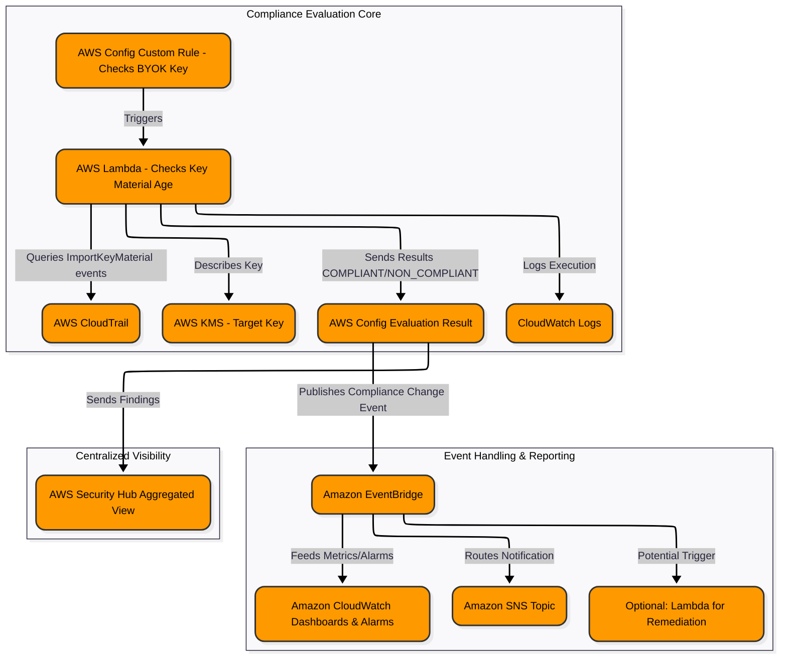

```mermaid
---
config:
  layout: elk
  theme: redux
  look: neo
---
flowchart TD
 subgraph subGraph0["Compliance Evaluation Core"]
        Lambda("AWS Lambda - Checks Key Material Age")
        ConfigRule("AWS Config Custom Rule - Checks BYOK Key")
        CT("AWS CloudTrail")
        KMS("AWS KMS - Target Key")
        ConfigEval("AWS Config Evaluation Result")
        CWLogs("CloudWatch Logs")
  end
 subgraph subGraph1["Event Handling & Reporting"]
        EB("Amazon EventBridge")
        SNS("Amazon SNS Topic")
        RemediationLambda("Optional: Lambda for Remediation")
        CW("Amazon CloudWatch Dashboards & Alarms")
  end
 subgraph subGraph2["Centralized Visibility"]
        SecHub("AWS Security Hub Aggregated View")
  end
    ConfigRule -- Triggers --> Lambda
    Lambda -- Queries ImportKeyMaterial events --> CT
    Lambda -- Describes Key --> KMS
    Lambda -- Sends Results COMPLIANT/NON_COMPLIANT --> ConfigEval
    Lambda -- Logs Execution --> CWLogs
    ConfigEval -- Publishes Compliance Change Event --> EB
    EB -- Routes Notification --> SNS
    EB -- Potential Trigger --> RemediationLambda
    EB -- Feeds Metrics/Alarms --> CW
    ConfigEval -- Sends Findings --> SecHub
     Lambda:::awsService
     ConfigRule:::awsService
     CT:::awsService
     KMS:::awsService
     ConfigEval:::awsService
     CWLogs:::awsService
     EB:::awsService
     SNS:::awsService
     RemediationLambda:::awsService
     CW:::awsService
     SecHub:::awsService
    classDef awsService fill:#FF9900,stroke:#333,stroke-width:2px,color:#000
```