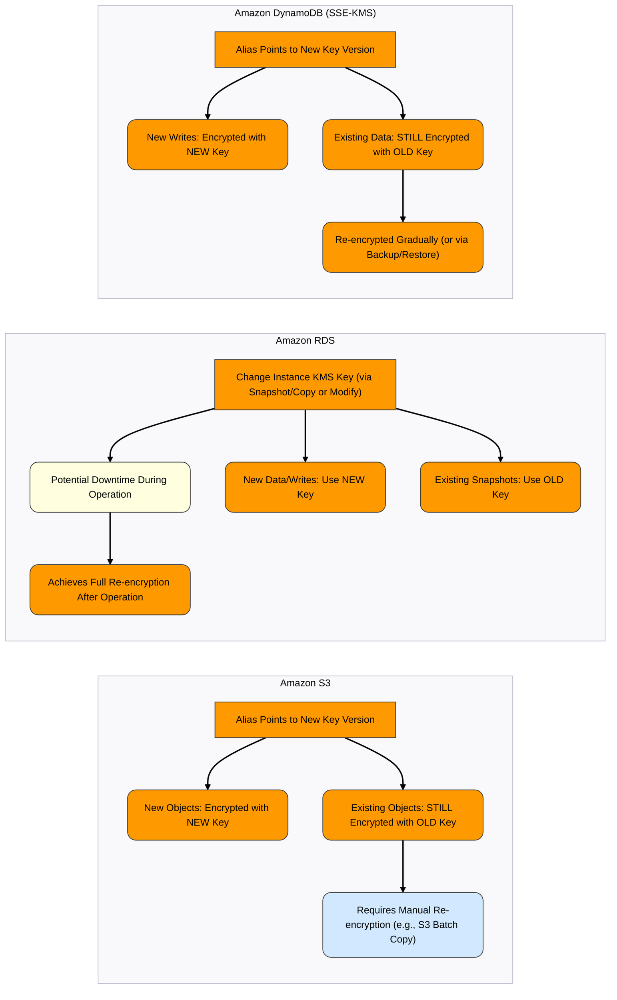

```mermaid
---
config:
  layout: fixed
  theme: redux
---
flowchart LR
 subgraph s1["Amazon S3"]
    direction TB
        S3_NewObj("New Objects: Encrypted with NEW Key")
        S3_KeyRot["Alias Points to New Key Version"]
        S3_OldObj("Existing Objects: STILL Encrypted with OLD Key")
        S3_ReEncrypt("Requires Manual Re-encryption (e.g., S3 Batch Copy)")
  end
 subgraph s2["Amazon RDS"]
    direction TB
        RDS_Downtime("Potential Downtime During Operation")
        RDS_KeyRot["Change Instance KMS Key (via Snapshot/Copy or Modify)"]
        RDS_NewData("New Data/Writes: Use NEW Key")
        RDS_OldSnap("Existing Snapshots: Use OLD Key")
        RDS_Compliance("Achieves Full Re-encryption After Operation")
  end
 subgraph s3["Amazon DynamoDB (SSE-KMS)"]
    direction TB
        DDB_NewWrite("New Writes: Encrypted with NEW Key")
        DDB_KeyRot["Alias Points to New Key Version"]
        DDB_OldData("Existing Data: STILL Encrypted with OLD Key")
        DDB_Gradual("Re-encrypted Gradually (or via Backup/Restore)")
  end
    S3_KeyRot --> S3_NewObj & S3_OldObj
    S3_OldObj --> S3_ReEncrypt
    RDS_KeyRot --> RDS_Downtime & RDS_NewData & RDS_OldSnap
    RDS_Downtime --> RDS_Compliance
    DDB_KeyRot --> DDB_NewWrite & DDB_OldData
    DDB_OldData --> DDB_Gradual
     S3_NewObj:::service
     S3_KeyRot:::service
     S3_OldObj:::service
     S3_ReEncrypt:::action
     RDS_Downtime:::impact
     RDS_KeyRot:::service
     RDS_NewData:::service
     RDS_OldSnap:::service
     RDS_Compliance:::service
     DDB_NewWrite:::service
     DDB_KeyRot:::service
     DDB_OldData:::service
     DDB_Gradual:::service
    classDef service fill:#FF9900,stroke:#333,stroke-width:1px,color:#000
    classDef impact fill:#FFFFE0,stroke:#333,stroke-width:1px,color:#000
    classDef action fill:#D1E8FF,stroke:#333,stroke-width:1px,color:#000
```