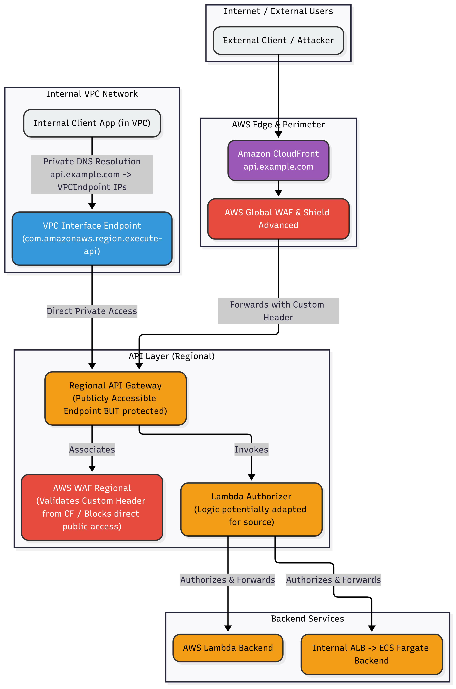

# Scenario 2: APIs-as-a-Product - Public and Private APIs Strategy

## 1. Overview and Context

This scenario evaluates the current architecture for building and deploying APIs on AWS, encompassing both internal (application-to-application) and public (customer, broker, etc.) usage patterns. The goal is to identify weaknesses in the existing setup and propose a revised architecture that securely and efficiently handles different API exposure levels, specifically addressing the need for private APIs and optimized internal traffic flow.

## 2. Understanding the Current Architecture

Based on the provided diagram and technical details, the current API deployment model exhibits the following characteristics:

*   **Unified Entry Point:** All API traffic, regardless of origin (public internet or internal network), is routed through a single domain (`api.<organization-domain>.com`) served by **Amazon CloudFront**.
*   **Edge Security:** The CloudFront distribution is protected by **AWS Global WAF v2** and **AWS Shield Advanced**.
*   **API Gateway Layer:** Traffic is then directed to multiple **Amazon API Gateway** regional endpoints. These APIs are developed and maintained by different teams.
*   **Authentication/Authorization:** A central **AWS Lambda Authorizer** is invoked by the API Gateways to handle identity and authorization before requests reach backend services.
*   **Backend Services:** The actual business logic resides in either:
    *   **AWS Lambda** functions.
    *   Internal **Application Load Balancers (ALBs)** fronting **AWS ECS Fargate** microservices.
*   **Design Philosophy:** A key point mentioned is that *all APIs are currently public "by design"*, accessible via the single CloudFront endpoint.
*   **(Diagram/Text Discrepancy Noted):** The provided diagram includes an icon labeled "Regional waf" positioned between the Global WAF and the API Gateways. However, the technical details only explicitly mention the *Global* WAF associated with CloudFront. AWS WAF deployment patterns typically involve either Global WAF (on CloudFront) OR Regional WAF (on regional resources like API Gateway/ALB), not usually in direct series for the same CloudFront-originating traffic. We will proceed assuming the primary current defense is the Global WAF as stated in the text, but will address the *need* for regional-level protection (potentially via Regional WAF on API GW or other mechanisms) as part of the weaknesses (Q1) and bypass protection solutions (Q4).

*(Placeholder for a cleaned/annotated current architecture diagram, e.g., `./diagrams/scenario2-current-architecture.png`)*

## 3. Question 1: Weaknesses in the Current Architecture

The current API architecture, while functional, presents several significant weaknesses, particularly concerning security posture, operational efficiency, and alignment with best practices for mixed public/internal API exposure:

1.  **Universal Public Exposure:**
    *   **Issue:** The most critical weakness is that *all* APIs, including those intended solely for internal application integration, are exposed publicly via the single CloudFront distribution (`api.<organization-domain>.com`) and associated regional API Gateway endpoints. This is explicitly mentioned as being "by design".
    *   **Risk:** This unnecessarily increases the attack surface. Internal APIs, which might have different security requirements or assumptions, are subjected to potential external threats, reconnaissance, and abuse attempts. It violates the principle of least exposure.

2.  **Potential for CloudFront/WAF Bypass:**
    *   **Issue:** The regional API Gateway endpoints themselves are publicly accessible (by default when created as REGIONAL type). While traffic *should* come through CloudFront/Global WAF, malicious actors or misconfigured clients could potentially discover and directly hit the `execute-api` URLs of the regional API Gateways.
    *   **Risk:** This bypasses the critical security layers provided by AWS Global WAF and Shield Advanced at the edge (CloudFront), potentially exposing the backend to direct attacks, DDoS, or uninspected traffic. (This is directly addressed in Question 4).

3.  **Ambiguous/Potentially Flawed WAF Strategy:**
    *   **Issue:** There is a discrepancy between the technical details (mentioning only the Global WAF at CloudFront) and the architecture diagram (showing an additional "Regional waf" in the flow).
        *   If there's *no* regional WAF protection directly on the API Gateways, it exacerbates the bypass risk (#2).
        *   If there *is* a Regional WAF *in addition* to the Global WAF (as the diagram might imply, although configured differently than shown), there could be redundant rule processing, increased management overhead, and potential cost inefficiencies if not designed carefully.
    *   **Risk:** Lack of clarity in the security design; potential gaps in protection if only Global WAF exists and bypass occurs; potential inefficiency if both exist without clear role separation.

4.  **Inefficient Internal Traffic Routing:**
    *   **Issue:** Internal clients/applications needing to consume internal APIs currently have to route their traffic out to the public internet, through CloudFront/WAF, and back into AWS to reach the API Gateway.
    *   **Risk:** This introduces unnecessary latency, potential egress data transfer costs, and subjects purely internal traffic to external security checks and potential edge failures, impacting internal system performance and reliability.

5.  **Centralized Lambda Authorizer Bottleneck/Blast Radius:**
    *   **Issue:** While centralizing authorization can have benefits, using a single Lambda Authorizer for *all* API Gateways creates a potential performance bottleneck and a single point of failure.
    *   **Risk:** High load across all APIs could throttle the authorizer. An error or failure within this single Lambda function could impact the availability of *all* APIs simultaneously, increasing the blast radius of any incident related to authorization.

6.  **Management Complexity:**
    *   **Issue:** Managing multiple independent API Gateways developed by different teams without strong governance can lead to inconsistencies in configuration, stage deployment, logging, monitoring, and adherence to standards.
    *   **Risk:** Increased operational burden, potential for configuration drift, and difficulties in maintaining a unified view of the entire API landscape.

## 4. Question 2: Redesign for Private API Exposure

To address the weaknesses identified, particularly the universal public exposure and inefficient internal routing, we propose a revised architecture focused on leveraging VPC endpoints and potentially distinct API Gateway deployments for different exposure levels. The goal is simplicity, efficiency, and minimal disruption compared to the current setup.

**Core Concepts of the Proposed Architecture:**

1.  **Introduce VPC Interface Endpoint for API Gateway (`execute-api`):**
    *   **Mechanism:** Deploy an **Interface VPC Endpoint** for the `execute-api` service within the VPC(s) where internal clients reside.
    *   **Benefit:** This creates a private entry point to access regional API Gateway APIs *directly from within the VPC* using private IP addresses, completely bypassing the public internet, CloudFront, and the Global WAF for internal traffic. This significantly reduces latency and potential egress costs for internal calls.

2.  **API Classification and Deployment Strategy (Option-Based):**
    *   Identify and classify APIs into three categories:
        *   **Internal-Only APIs:** Only consumed by applications within the VPC.
        *   **Public-Only APIs:** Only consumed by external clients via the internet.
        *   **Mixed-Use APIs:** Consumed by *both* internal and external clients.
    *   Based on this classification, choose a deployment strategy (two main options):

        *   **Option A (Simpler, leverages existing Gateways): Private + Public access on the SAME Regional Gateway:**
            *   Keep the existing **Regional** API Gateway endpoints (or potentially consolidate slightly if feasible). These endpoints remain accessible publicly via CloudFront/WAF for external consumers.
            *   Internal clients access these *same* regional API Gateways *privately* via the newly created **VPC Interface Endpoint**.
            *   **How it works:** When configured correctly (with Private DNS enabled for the VPC Endpoint), DNS queries for the `execute-api` hostname from within the VPC resolve to the private IPs of the endpoint, while public queries resolve to public IPs.
            *   **Pros:** Minimal disruption to existing API Gateway deployments and CloudFront setup. Reuses existing infrastructure. Simpler to manage initially.
            *   **Cons:** Internal-only APIs are still technically *reachable* via the public endpoint (though potentially blocked by fine-grained authorization if the Lambda authorizer can differentiate callers). Requires careful routing and potentially different authorization logic based on caller source (VPC vs. Internet).

        *   **Option B (More Secure Separation): Dedicated PRIVATE API Gateways + Existing Regional for Public/Mixed:**
            *   Deploy *new*, separate **Private** API Gateways specifically for **Internal-Only APIs**. These Private APIs are *only* accessible via the VPC Interface Endpoint. They have no public DNS record and cannot be reached from the internet.
            *   Keep the existing **Regional** API Gateways for **Public-Only** and **Mixed-Use APIs**.
            *   Internal clients access Internal-Only APIs via the VPC Endpoint hitting the Private API Gateways. Internal clients access Mixed-Use APIs via the VPC Endpoint hitting the Regional API Gateways. External clients access Public/Mixed-Use APIs via CloudFront hitting the Regional API Gateways.
            *   **Pros:** Provides the strongest network-level isolation for truly internal APIs. Clear separation of concerns. Simplifies authorization logic (Private APIs inherently trust VPC traffic more, potentially needing simpler auth checks).
            *   **Cons:** Requires deploying and managing additional Private API Gateways. Potentially higher initial setup effort and slight increase in cost/complexity.

3.  **Authorization Adaptation:**
    *   The central Lambda Authorizer might need adjustments depending on the chosen option:
        *   **Option A:** The authorizer may need logic to differentiate between calls coming via the public CloudFront path vs. the private VPC Endpoint path (e.g., inspecting source IP, presence/absence of specific headers injected by CloudFront) to apply potentially different authorization rules.
        *   **Option B:** Private API Gateways could potentially use simpler authorization mechanisms (e.g., Resource Policies restricting source VPC/Endpoint, simpler Lambda logic, or even IAM authorization if services use IAM roles) since the network path is already trusted. The existing Lambda Authorizer would remain primarily for the Regional (public/mixed) APIs.

**Recommended Approach (Balancing Simplicity and Security):**

While Option B offers stronger isolation, **Option A (Private + Public access on SAME Regional Gateway via VPC Endpoint)** often provides the best balance of achieving the core requirements (internal traffic stays private) with **simplicity and minimal disruption** to the existing setup, aligning with the request for an efficient, low-impact solution. This requires careful implementation of Private DNS for the VPC endpoint and potentially adjusting the Lambda Authorizer logic.

If absolute network isolation for internal APIs is paramount, or if managing differentiated authorization on the same gateway proves too complex, then Option B becomes the preferred choice despite the added deployment overhead.

*(The Proposed Architecture Diagram in Section 7 should illustrate the chosen option, likely Option A initially, showing both traffic paths).*

## 5. Question 3: CloudFront Path-Based Routing Configuration

The current architecture already implies that CloudFront needs to route requests to multiple backend API Gateways, likely based on the request path, as different teams manage different APIs but share the single `api.<organization-domain>.com` entry point. Configuring CloudFront for path-based routing involves defining multiple **Origins** and **Cache Behaviors** within the CloudFront distribution:

1.  **Define Multiple Origins:**
    *   For each distinct regional API Gateway endpoint that needs to be accessed via CloudFront, define a separate **Origin** in the CloudFront distribution settings.
    *   **Origin Domain Name:** Use the `execute-api` invoke URL for each regional API Gateway (e.g., `<api-id>.execute-api.<region>.amazonaws.com`).
    *   **Origin Path (Optional but Recommended):** It's often useful to include the API Gateway stage name (e.g., `/prod`, `/v1`) in the Origin Path field. This simplifies the CloudFront behavior path patterns and keeps the stage name out of the public URL path.
    *   **Origin Protocol Policy:** Typically set to `HTTPS Only`.
    *   **Origin Custom Headers (Crucial for Bypass Protection - See Q4):** Add a custom header (e.g., `X-Api-Key`, `X-Internal-Secret`) with a secret value known only to CloudFront and API Gateway. This header will be forwarded by CloudFront and validated at the API Gateway level to ensure requests came through CloudFront.
    *   **Connection Attempts/Timeout:** Configure appropriate values.

2.  **Define Cache Behaviors for Path Patterns:**
    *   CloudFront uses **Cache Behaviors** to determine how requests matching specific path patterns are handled, including which Origin they are forwarded to.
    *   **Default Behavior (`*`):** Configure a default cache behavior that might handle root requests or act as a fallback. This typically points to one of the main API Gateway origins or returns a specific response.
    *   **Path-Specific Behaviors:** For each group of API endpoints belonging to a specific API Gateway (or logical service), create a new Cache Behavior:
        *   **Path Pattern:** Define a pattern that uniquely identifies requests for that group (e.g., `/users/*`, `/orders/*`, `/products/v2/*`). CloudFront matches these in order, so place more specific patterns before more general ones.
        *   **Origin and Origin Group:** Select the specific **Origin** (defined in step 1) corresponding to the correct backend API Gateway for this path pattern.
        *   **Viewer Protocol Policy:** Usually `Redirect HTTP to HTTPS`.
        *   **Allowed HTTP Methods:** Configure allowed methods (GET, HEAD, POST, PUT, DELETE, etc.).
        *   **Cache Policy and Origin Request Policy:** Configure caching settings (often minimal or no caching for dynamic APIs) and which headers/cookies/query strings are forwarded to the origin (important for authorization, pagination, etc.). Ensure the custom header for bypass protection is included in the Origin Request Policy.
        *   **Response Headers Policy:** Configure CORS or other response headers if needed.
        *   **(Optional) WAF Association:** Although the Global WAF is associated at the distribution level, specific cache behaviors could potentially have nuanced configurations if needed, though often not required for WAF itself.

**Example Configuration Flow:**

*   Request `https://api.example.com/users/123`
    *   CloudFront checks Behaviors.
    *   Matches Path Pattern `/users/*`.
    *   This behavior points to Origin "APIGW-Users" (`<users-api-id>.execute-api...`).
    *   CloudFront forwards the request `/users/123` (potentially stripping `/users` if configured via Origin Path) to the "APIGW-Users" origin, including necessary headers (like `Host`, forwarded auth headers, and the custom secret header).
*   Request `https://api.example.com/orders/456`
    *   CloudFront checks Behaviors.
    *   Matches Path Pattern `/orders/*`.
    *   This behavior points to Origin "APIGW-Orders" (`<orders-api-id>.execute-api...`).
    *   CloudFront forwards the request `/orders/456` to the "APIGW-Orders" origin.

By correctly configuring multiple Origins (one per target API GW) and Cache Behaviors (matching specific URL path patterns to those Origins), CloudFront can effectively act as a central router or reverse proxy for the multiple backend API Gateways.

## 6. Question 4: Protecting Regional APIGW Endpoints from Bypass

As identified in the weaknesses (Section 3.2), the public nature of Regional API Gateway endpoints creates a risk that clients might bypass CloudFront and the associated Global WAF/Shield Advanced protections by directly invoking the `<api-id>.execute-api.<region>.amazonaws.com` URL. To mitigate this bypass risk and ensure all traffic flows through CloudFront, several layered solutions can be implemented:

**1. Custom Header Validation (Recommended Primary Method):**

*   **Concept:** Configure CloudFront to add a unique, secret custom HTTP header to all requests it forwards to the API Gateway origins. Then, configure the API Gateways to *only* accept requests containing this specific header with the correct secret value. Requests lacking the header or having an incorrect value are rejected.
*   **Implementation Steps:**
    1.  **Generate Secret Value:** Create a strong, unpredictable secret value (e.g., a long random string or UUID). Store this securely (e.g., AWS Secrets Manager or Systems Manager Parameter Store). **Do not hardcode it.**
    2.  **CloudFront Origin Configuration:** For each API Gateway origin defined in CloudFront (as discussed in Section 5), add an **Origin Custom Header**.
        *   Header Name: Choose a non-standard name (e.g., `X-Origin-Verify`, `X-Internal-Signature`).
        *   Header Value: The secret value generated in step 1.
    3.  **API Gateway Validation:** Configure validation at the API Gateway level to check for the presence and correctness of this custom header. This can be done using:
        *   **AWS WAF Regional:** Associate a Regional WAF WebACL directly with each Regional API Gateway stage. Create a custom rule within this WebACL that checks if the `X-Origin-Verify` header exists and matches the secret string. Set the rule action to `ALLOW` if it matches and the default action of the WebACL to `BLOCK`. This explicitly blocks any request that doesn't have the valid header. **This is generally the most robust and recommended approach.**
        *   **Lambda Authorizer:** Modify the existing central Lambda Authorizer (or dedicated authorizers if decentralizing) to include logic that inspects incoming request headers. If the expected custom header and secret value are *not* present, the authorizer should return an `Unauthorized` (401) or `Forbidden` (403) policy response, denying access before the request even reaches the backend integration.
        *   **API Gateway Request Validator (Less Secure for this purpose):** While API Gateway has built-in request validation, it's typically better suited for checking standard parameters (query strings, standard headers, body schemas) rather than enforcing a secret custom header for origin verification. WAF or Lambda Authorizer provide stronger, more explicit control for this security requirement.
*   **Pros:** Highly effective, standard pattern, flexible validation options (WAF preferred).
*   **Cons:** Requires managing a secret value; slight overhead in CloudFront configuration and chosen validation mechanism.

**2. AWS WAF Regional IP Restrictions (More Complex/Less Flexible):**

*   **Concept:** Instead of a custom header, configure the Regional WAF associated with the API Gateways to only allow traffic originating from CloudFront's known public IP address ranges.
*   **Implementation:**
    *   Subscribe to AWS IP address range notifications.
    *   Maintain an IP Set within the Regional WAF rules that contains CloudFront's current edge server IP ranges.
    *   Set the WAF rule to `ALLOW` traffic from this IP Set and `BLOCK` all other traffic.
*   **Pros:** Doesn't rely on a shared secret header.
*   **Cons:**
    *   **Operational Overhead:** AWS IP ranges change, requiring constant monitoring and updating of the WAF IP Set (can be automated but adds complexity). Failure to update can block legitimate traffic.
    *   **Less Precise:** Allows *any* traffic from a CloudFront IP, not just traffic specifically proxied by *your* distribution. Theoretically, another CloudFront customer could route traffic from a CloudFront IP to your exposed API Gateway endpoint if they knew the URL. (The custom header method prevents this).

**Recommendation:**

The **Custom Header Validation method, ideally implemented using AWS WAF Regional** associated with each API Gateway stage, is the most secure, reliable, and recommended approach to prevent CloudFront bypass. It ensures that only requests processed by your specific CloudFront distribution (which adds the secret header) are allowed by the API Gateways.

## 7. Proposed Architecture Diagram

## 8. Additional Considerations (Security, Governance, Cost)

Implementing the proposed architecture requires attention to several related aspects:

*   **Security Enhancements:**
    *   **Fine-Grained Authorization:** Enhance the Lambda Authorizer (or implement separate authorizers/methods for private paths) to enforce stricter permissions based on whether the caller is internal (via VPC Endpoint) or external (via CloudFront). Internal callers might be trusted more based on network origin. Consider using IAM authorization for internal service-to-service calls via the VPC Endpoint if applicable.
    *   **Resource Policies:** API Gateway Resource Policies can further restrict access, for example, by explicitly allowing only the VPC Endpoint ID or specific source VPCs to invoke certain APIs or methods, especially if using Option B (Private API Gateways).
    *   **Rate Limiting & Throttling:** Implement appropriate usage plans, rate limiting, and throttling at the API Gateway level for both public and internal traffic paths to protect backend resources. Configure WAF rate-based rules for edge protection.
    *   **Input Validation:** Ensure robust input validation happens within the API Gateway (using request validators) or backend services.
*   **Governance and Consistency:**
    *   **API Standards:** Establish and enforce clear standards across teams for API design (e.g., RESTful principles, OpenAPI specs), security configurations, logging formats, and stage deployment processes, especially when managing multiple Regional and potentially Private API Gateways.
    *   **Discovery:** Implement an internal API discovery mechanism (e.g., a simple registry or leveraging service discovery tools) so internal clients can easily find and consume private APIs.
    *   **IaC:** Define all components (VPC Endpoints, API Gateways, WAF ACLs, Lambda Authorizers, supporting IAM roles) using Infrastructure as Code (Terraform/CloudFormation) for consistent and repeatable deployments across environments.

## 9. References

*(Content to be added)*

---
*This concludes the detailed analysis and proposed solution for Scenario 2.*