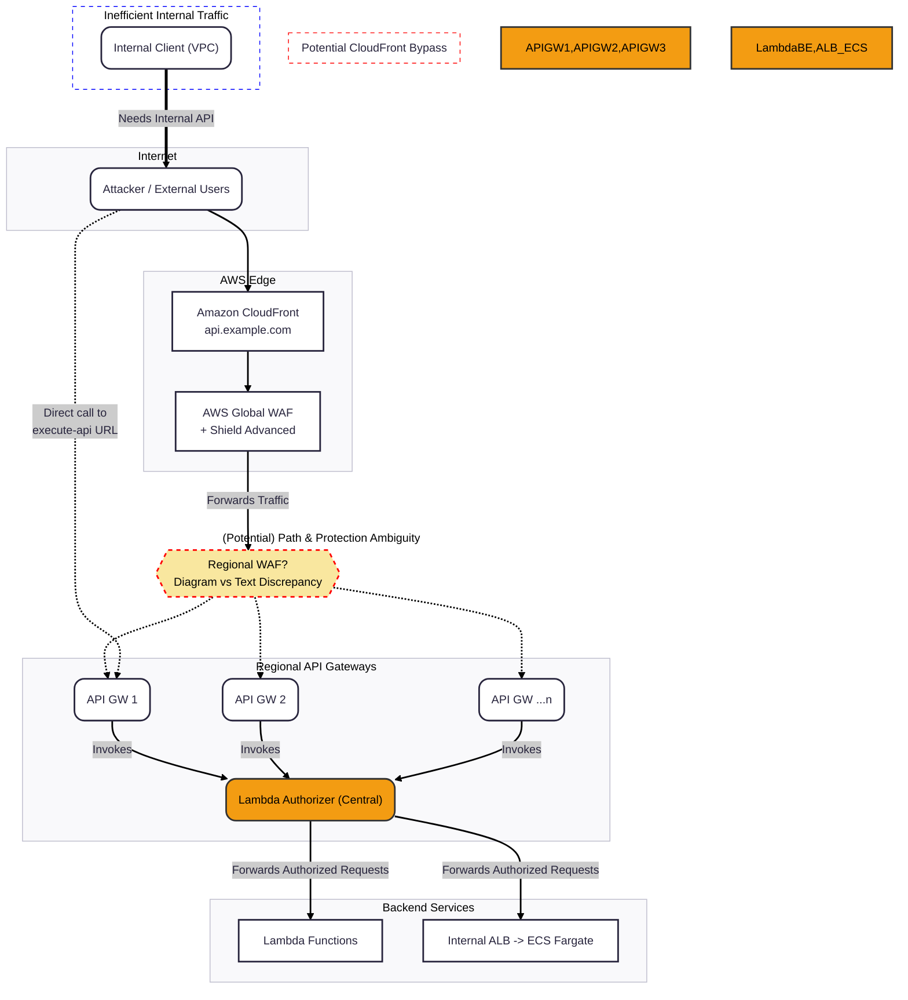

```mermaid
---
config:
  layout: dagre
  theme: redux
---
flowchart TD
 subgraph Internet["Internet"]
        A1("Attacker / External Users")
  end
 subgraph Edge["AWS Edge"]
        CF["Amazon CloudFront<br>api.example.com"]
        GWAF["AWS Global WAF<br>+ Shield Advanced"]
  end
 subgraph ProblematicFlow["(Potential) Path & Protection Ambiguity"]
        RWAF{{"Regional WAF?<br>Diagram vs Text Discrepancy"}}
  end
 subgraph RegionalLayer["Regional API Gateways"]
    direction LR
        APIGW1("API GW 1")
        APIGW2("API GW 2")
        APIGW3("API GW ...n")
        LAuth("Lambda Authorizer (Central)")
  end
 subgraph Backend["Backend Services"]
    direction LR
        LambdaBE["Lambda Functions"]
        ALB_ECS["Internal ALB -> ECS Fargate"]
  end
 subgraph BypassPath["Potential CloudFront Bypass"]
  end
 subgraph InefficientInternal["Inefficient Internal Traffic"]
        InternalClient("Internal Client (VPC)")
  end
    A1 --> CF
    CF --> GWAF
    GWAF -- Forwards Traffic --> RWAF
    RWAF -.-> APIGW1 & APIGW2 & APIGW3
    APIGW1 -- Invokes --> LAuth
    APIGW2 -- Invokes --> LAuth
    APIGW3 -- Invokes --> LAuth
    LAuth -- Forwards Authorized Requests --> LambdaBE & ALB_ECS
    A1 -. "Direct call to <br>execute-api URL" .-> APIGW1
    InternalClient == Needs Internal API ==> A1
    APIGW1,APIGW2,APIGW3["APIGW1,APIGW2,APIGW3"]
    LambdaBE,ALB_ECS["LambdaBE,ALB_ECS"]
    style RWAF fill:#F9E79F,stroke:#f00,stroke-dasharray: 5 5,color:black
    style LAuth fill:#F39C12,stroke:#333,color:#000
    style APIGW1,APIGW2,APIGW3 fill:#F39C12,stroke:#333,color:#000
    style LambdaBE,ALB_ECS fill:#F39C12,stroke:#333,color:#000
    style ProblematicFlow fill:none,stroke:none
    style BypassPath fill:none,stroke:#f00,stroke-width:1px,stroke-dasharray: 5 5
    style InefficientInternal fill:none,stroke:#00f,stroke-width:1px,stroke-dasharray: 5 5
```