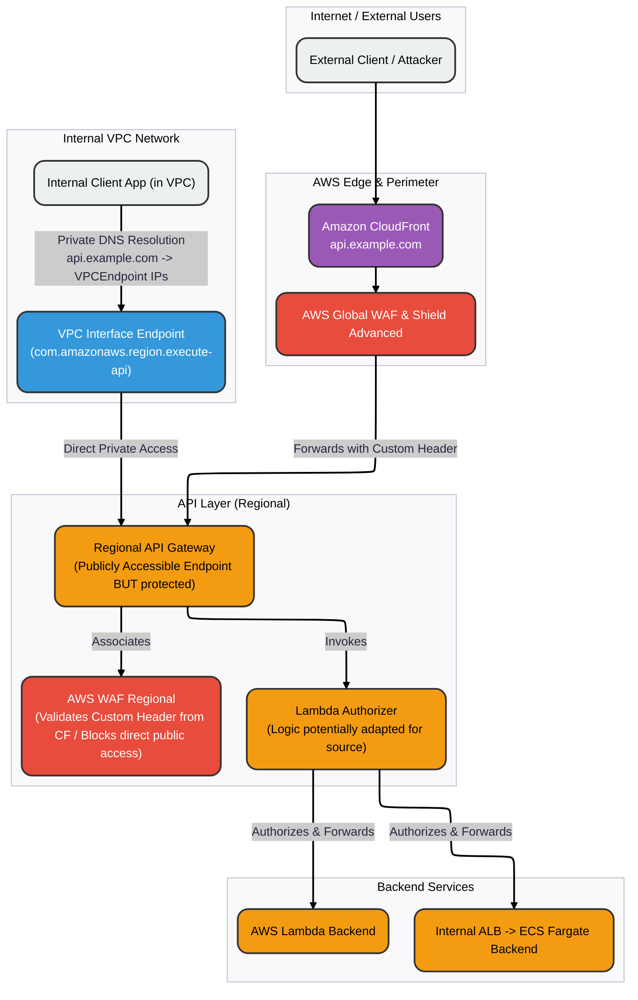

```mermaid
---
config:
  layout: elk
  theme: redux
---
flowchart TD
 subgraph subGraph0["Internet / External Users"]
        ExtUser("External Client / Attacker")
  end
 subgraph subGraph1["AWS Edge & Perimeter"]
        CF("Amazon CloudFront<br>api.example.com")
        GWAF("AWS Global WAF & Shield Advanced")
  end
 subgraph subGraph2["Internal VPC Network"]
    direction TB
        IntClient("Internal Client App (in VPC)")
        VPCEndpoint("VPC Interface Endpoint<br>(com.amazonaws.region.execute-api)")
  end
 subgraph subGraph3["API Layer (Regional)"]
    direction TB
        APIGW_Regional("Regional API Gateway<br>(Publicly Accessible Endpoint BUT protected)")
        RWAF("AWS WAF Regional<br>(Validates Custom Header from CF / Blocks direct public access)")
        LAuth("Lambda Authorizer<br>(Logic potentially adapted for source)")
  end
 subgraph subGraph4["Backend Services"]
    direction TB
        LambdaBE("AWS Lambda Backend")
        ALB_ECS("Internal ALB -> ECS Fargate Backend")
  end
    ExtUser --> CF
    CF --> GWAF
    IntClient -- "Private DNS Resolution<br>api.example.com -&gt; VPCEndpoint IPs" --> VPCEndpoint
    GWAF -- Forwards with Custom Header --> APIGW_Regional
    VPCEndpoint -- Direct Private Access --> APIGW_Regional
    APIGW_Regional -- Associates --> RWAF
    APIGW_Regional -- Invokes --> LAuth
    LAuth -- Authorizes & Forwards --> LambdaBE & ALB_ECS
     ExtUser:::vpc
     CF:::cloudfront
     GWAF:::waf
     IntClient:::vpc
     VPCEndpoint:::network
     APIGW_Regional:::apigw
     RWAF:::waf
     LAuth:::lambda
     LambdaBE:::lambda
     ALB_ECS:::compute
    classDef cloudfront fill:#9B59B6,stroke:#333,color:#fff
    classDef waf fill:#E74C3C,stroke:#333,color:#fff
    classDef apigw fill:#F39C12,stroke:#333,color:#000
    classDef lambda fill:#F39C12,stroke:#333,color:#000
    classDef compute fill:#F39C12,stroke:#333,color:#000
    classDef network fill:#3498DB,stroke:#333,color:#fff
    classDef vpc fill:#ECF0F1,stroke:#333,color:#000
```